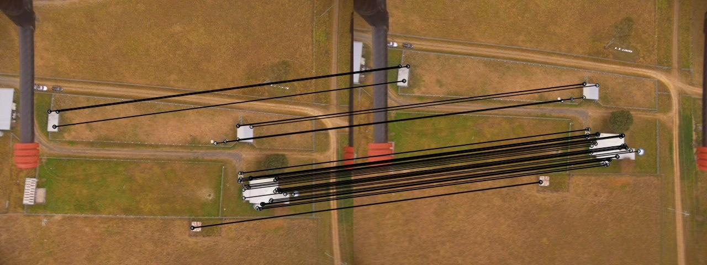
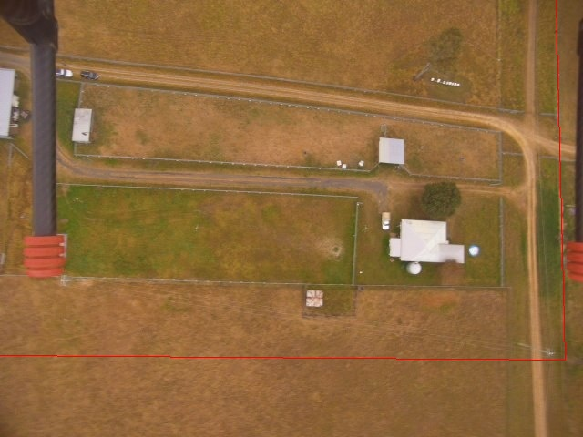

# Find_Overlap_OpenCV

Finding a transform between two overlapped images Using OpenCV in C++ 

In this project I have defined two classes: Overlap and border

border: could be a general class for borders of different shape

Overlap: uses ORB feature detection to detect keypoints in two images and then finds a transform between them
The picture below shows the matched feature points between two overlapped aerial images. Notice how a fixed landing gear of the drone has been ignored in the transform. This is a result of the inbuilt RANSAC method in CV::findHomography  

The code plots the border of the first image as a red rectangle inside the second image as below:

## Installation

Requires OpenCV 2.4.13 
To use with OpenCV 3.x.x some changes should be done according to 
https://docs.opencv.org/3.2.0/db/dfa/tutorial_transition_guide.html

## Usage

cd [directory]

make

./build/ImgProc

## Contributing
1. Fork it!
2. Create your feature branch: `git checkout -b my-new-feature`
3. Commit your changes: `git commit -am 'Add some feature'`
4. Push to the branch: `git push origin my-new-feature`
5. Submit a pull request :D

## History

## Credits
Mostafa Shabani

## License
This project is licensed under the MIT License 

